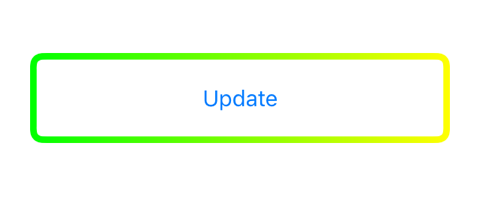
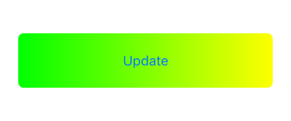
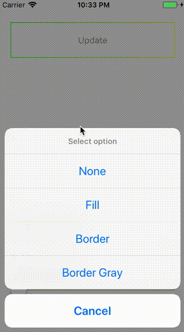

# GradientBorderButton
Button with gradient border or fill.


GradientBorderButton is a Swift library which can help you avoid some boilerplate code.







## Installation

#### Manually
1. Download and drop ```Sources``` folder in your project.  
2. Congratulations!

## Usage example

1. Using storyboard, just set class of your button to ```GradientBorderButton```
2. Programmatically 
```swift
let gradientButton = GradientBorderButton(frame: CGRect(x: 0, y: 0, width: 200, height: 50))
view.addSubview(gradientButton)
```

## Default values

* BorderWidth = 1
* LeftColor = UIColor.green
* RightColor = UIColor.yellow
* GrayColor = UIColor.lightGray
* CornerRadius = 0

## Customization

1. Available ```GradientButtonState```'s: ```.none```, ```.fill```, ```.border```, ```.borderGray```
```swift
yourGradientBorderButton.update(state: .fill)
```
2. Using ```GradientButtonOptions```


Available parameters: 
* borderWidth
* leftColor
* rightColor
* grayColor
* cornerRadius

Instantiate your options and pass them to button.
```swift
let options = GradientButtonOptions(borderWidth: 4)
yourGradientBorderButton.configure(with: options)
```

## Note

Each update with ```GradientButtonOptions``` updates only options you passed in.


## Meta

Distributed under the MIT license. See ``LICENSE`` for more information.
